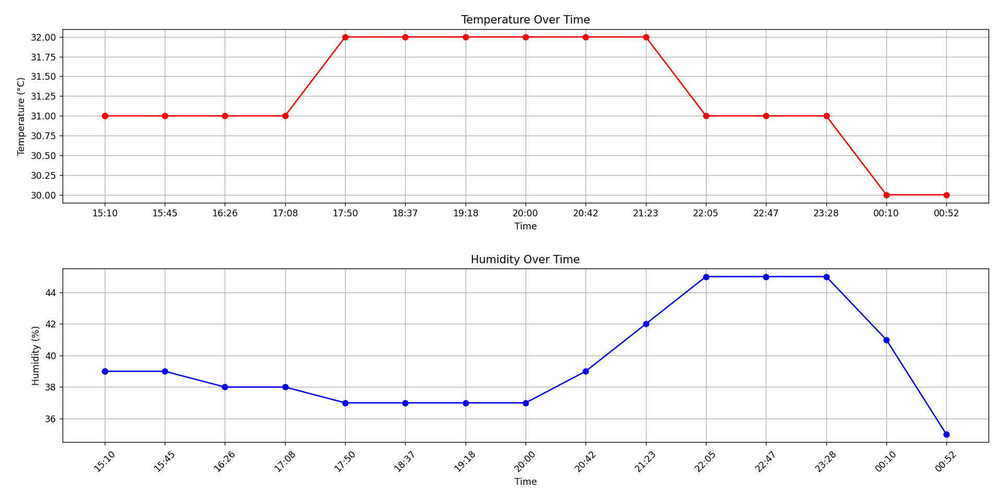

# 📡 Temperature & Humidity Logger

A simple project to measure, log, and visualize **temperature** and **humidity** data using an Arduino-compatible microcontroller, a **DHT11 sensor**, and Python scripts.

---

## 📁 Project Structure

```bash
.
├── simpletemp.ino           # Arduino code to read from DHT11 sensor and print to Serial
├── read_serial_to_csv.py    # Python script to read serial data and save to CSV
├── plot.py                  # Python script to visualize data from CSV
├── sensor_data.csv          # Output file containing timestamped sensor readings
```

---

## ⚙️ What Each File Does

### 1. `simpletemp.ino`

This Arduino sketch reads temperature and humidity values from a **DHT11 sensor** every \~8 minutes (500,000 ms), and sends the data over the Serial port in the format:

```
<temperature>,<humidity>
```

#### Requirements

* A DHT11 sensor connected to **digital pin 4**
* DHT non-blocking library (DHT\_nonblocking)

### 2. `read_serial_to_csv.py`

This Python script listens to the serial port (e.g. `COM3`) and appends the incoming sensor data into a CSV file `sensor_data.csv`. Each row is structured as:

```
<HHMM>,<temperature>,<humidity>
```

For example, a reading at 2:45 PM might be:

```
1445, 22.5, 58.2
```

#### Requirements

* Python 3.x
* `pyserial` module

```bash
pip install pyserial
```

### 3. `plot.py`

This script reads `sensor_data.csv` and creates two line plots:

* **Temperature over Time** (top plot)
* **Humidity over Time** (bottom plot)

The x-axis shows the time in `HH:MM` format, and the y-axis shows the corresponding values.


#### Requirements

* `matplotlib` module

```bash
pip install matplotlib
```

---

## 🚀 How to Run the Project

1. **Upload `simpletemp.ino`** to your Arduino-compatible board.
2. **Run `read_serial_to_csv.py`** on your PC to start logging data.
3. Let it run and collect data over time.
4. When ready, run **`plot.py`** to generate and view the charts.

---

## 📝 Notes

* Make sure the correct `SERIAL_PORT` is configured in `read_serial_to_csv.py`.
* The script logs data every 8+ minutes, as configured in the Arduino code.
* If you want more frequent readings, reduce the delay in `simpletemp.ino`.

---

## 📊 Example Output

The resulting graphs will help you visualize temperature and humidity trends throughout the day.



---

